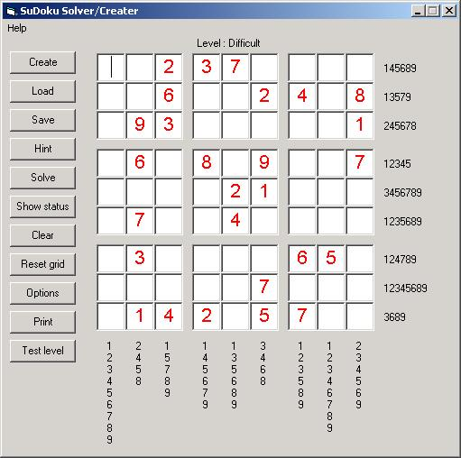



## Sudoku Solver/Creator

### Description

Here is another SUDOKU SOLVER/CREATOR.

This one can solve almost any puzzle, it has 8 different logical solving methods and a guessing mode. It can create 7 different puzzle levels and of course it can solve them (3x3 and 4x4) (the hardest levels need guessing). it can load/save puzzles, give hints, show a log file of how it has solved a puzzle, print puzzles (or complete puzzlebooks) and much more.

There is a complete helpfile in it with al the possibilities so playing with this program should not be a problem.

Thanks for the persons who builded the module INIs.bas and PrintMod.bas so i didn't have to reinvent it again.
 
### More Info
 

             |
---                |---
**Submitted On**   |2005-08-12 23:57:20
**By**             |[Marco v/d Berg](https://github.com/Planet-Source-Code/PSCIndex/blob/master/ByAuthor/marco-v-d-berg.md)
**Level**          |Intermediate
**User Rating**    |4.6 (69 globes from 15 users)
**Compatibility**  |VB 6\.0
**Category**       |[Complete Applications](https://github.com/Planet-Source-Code/PSCIndex/blob/master/ByCategory/complete-applications__1-27.md)
**World**          |[Visual Basic](https://github.com/Planet-Source-Code/PSCIndex/blob/master/ByWorld/visual-basic.md)
**Archive File**   |[Sudoku\_Sol1924118152005\.zip](https://github.com/Planet-Source-Code/marco-v-d-berg-sudoku-solver-creator__1-62195/archive/master.zip)

